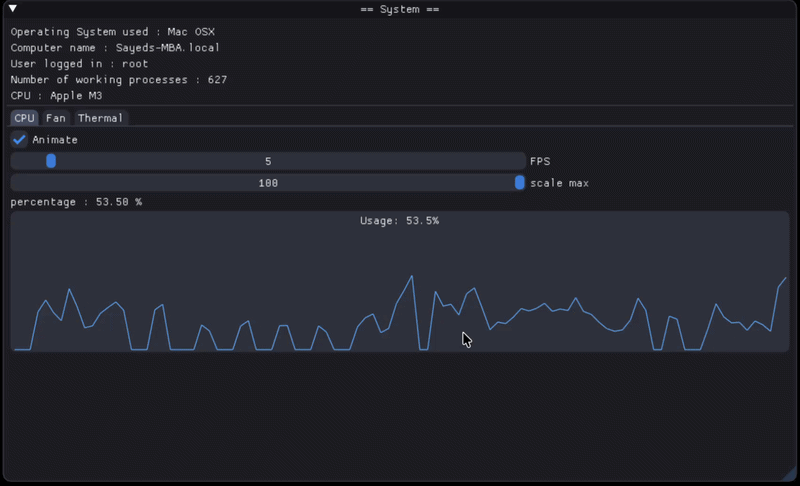
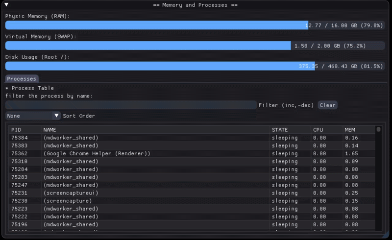
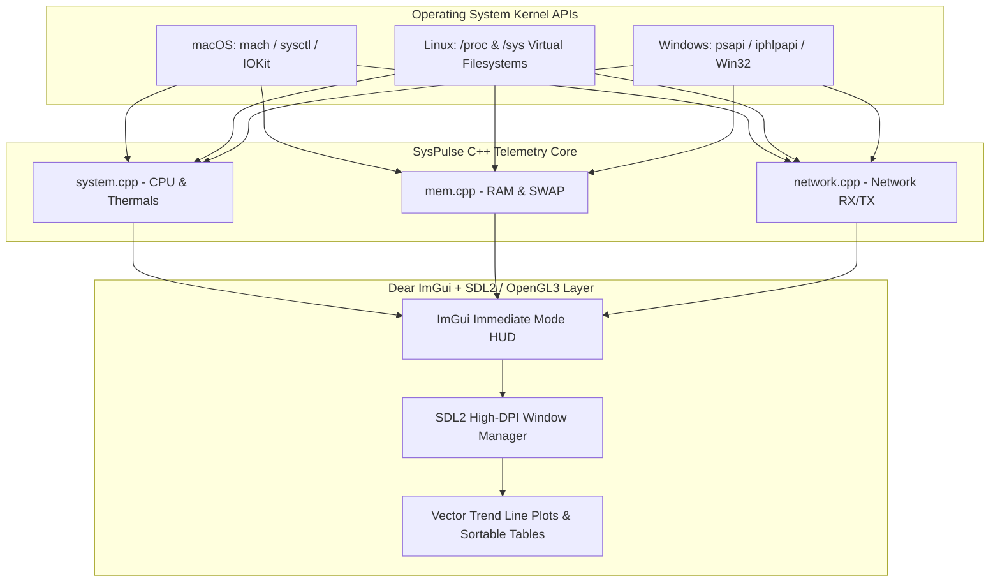
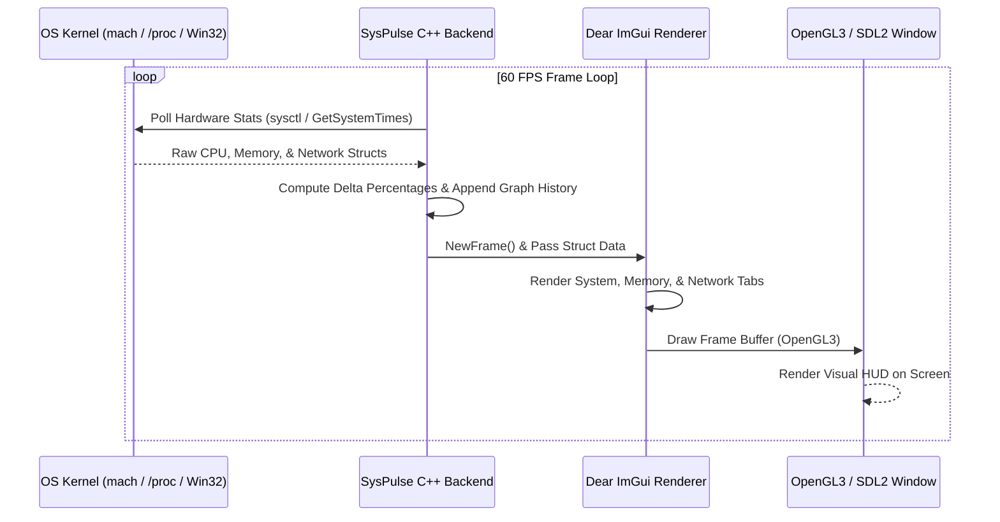

# 📊 SysPulse

[](https://cplusplus.com/)
[](#-system-architecture)
[](#-setup--execution)
[](LICENSE.md)

**SysPulse** is a lightweight, cross-platform hardware utility and system performance dashboard implemented in C++. Powered by **Dear ImGui** and SDL2/OpenGL3, SysPulse interfaces directly with OS kernel APIs to display real-time CPU utilization, thermal sensor readings, fan speeds, memory allocations, process tables, and network throughput graphs.

---

## ⚡ Key Highlights

- **Native Platform API Bridges**: Zero-overhead OS polling using platform-native system calls:
  - **macOS (Apple Silicon & Intel)**: `sysctl`, `mach`, `libproc`, and IOKit hardware bridges.
  - **Linux**: `/proc` and `/sys` filesystem polling drivers.
  - **Windows (MinGW/MSVC)**: Win32 API (`psapi`, `iphlpapi`, `GetSystemTimes`).
- **Immediate-Mode GUI Performance**: Built with Dear ImGui for hardware-accelerated 60 FPS HUD rendering.
- **Interactive Process Manager**: Sortable process grid with search filtering, PID tracking, memory consumption metrics, and CPU usage percentages.
- **Dynamic Graphical Overlays**: Real-time vector graphs tracking CPU history, thermal sensor temperatures (°C), and cooling fan RPMs with adjustable FPS sample rates.
- **Auto-Scaling Network Monitor**: Dual-channel RX/TX network traffic visualization automatically scaling units from Bytes to Gigabytes.

---

## 📋 Table of Contents

- [Key Highlights](#-key-highlights)
- [System Architecture](#-system-architecture)
- [Hardware Polling & Rendering Cycle](#-hardware-polling--rendering-cycle)
- [Setup & Execution](#-setup--execution)
- [Project Directory Structure](#-project-directory-structure)
- [License](#-license)

---

## 🖼️ Interface Demonstrations

| CPU & System Hardware Telemetry | Memory Allocation & Process Table |
| :---: | :---: |
|  |  |

---

## 🏗️ System Architecture



---

## 📐 Hardware Polling & Rendering Cycle



---

## 🚀 Setup & Execution

### Prerequisites

- **C++ Compiler**: `g++` or `clang++` (C++14 support).
- **SDL2**: Library and headers installed.

#### Installing SDL2 Dependencies:

- **macOS**:
  ```bash
  brew install sdl2
  ```
- **Linux (Debian/Ubuntu)**:
  ```bash
  sudo apt-get install libsdl2-dev
  ```
- **Windows (MSYS2)**:
  ```bash
  pacman -S mingw-w64-x86_64-SDL2
  ```

---

### Build & Run

1. **Clone Repository**:
   ```bash
   git clone https://github.com/sahmedhusain/syspulse.git
   cd syspulse
   ```

2. **Compile Application**:
   ```bash
   make clean
   make
   ```

3. **Launch SysPulse**:
   ```bash
   ./syspulse
   ```

---

## 📂 Project Directory Structure

```
syspulse/
├── Makefile              # Cross-platform build script (macOS, Linux, Windows)
├── README.md             # Project documentation
├── header.h              # Unified cross-platform telemetry structs & API declarations
├── main.cpp              # Application entrypoint & ImGui window coordinator
├── system.cpp            # CPU, fan speed, & thermal sensor polling logic
├── mem.cpp               # RAM, SWAP, & process table gathering logic
├── network.cpp           # Bandwidth RX/TX network traffic tracking logic
└── imgui/                # Dear ImGui library & OpenGL3/SDL2 backends
```

---

## 📄 License

Distributed under the MIT License. See [LICENSE](LICENSE.md) for details.