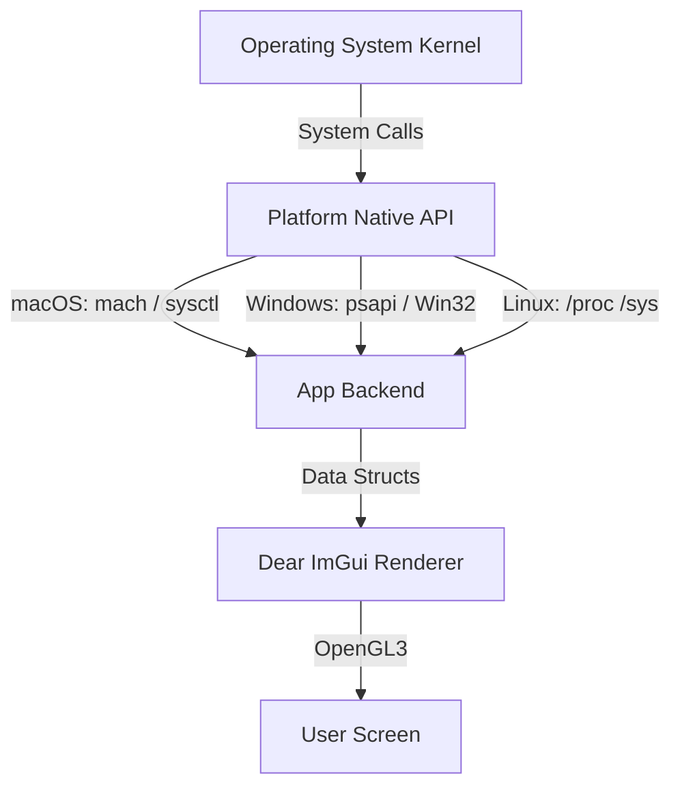

# System Monitor Desktop 📊

[](https://cplusplus.com/)
[](#-how-the-code-works)
[](#-how-the-code-works)
[](LICENSE.md)

<p align="center">
	
</p>

**System Monitor Desktop** is a lightweight, cross-platform utility written in C++ that visualizes your computer's performance metrics in real-time. Modeled after top-tier system task managers, it taps directly into deep OS metrics to render performance graphs and granular process lists using **Dear ImGui**.

---

## ⚡ What's cool about it?

- **Cross-Platform Native Calls**: Written cleanly with `#ifdef` macros to leverage the absolute fastest APIs natively:
  - **Linux**: `/proc` and `/sys` filesystem polling.
  - **macOS (Apple Silicon & Intel)**: `sysctl`, `mach`, `libproc`, and IOKit hardware bridges.
  - **Windows (MinGW/MSVC)**: Win32 API (`psapi`, `iphlpapi`, `GetSystemTimes`).
- **Immediate Mode GUI**: Powered by the industry-standard **Dear ImGui** (via SDL2/OpenGL3 backend) for a blazing fast, zero-overhead HUD.
- **Granular Filtering**: Search and multi-select processes with live sorting. Easily track down memory hogs!
- **Dynamic Graphical Overlays**: Live, tabbed performance tracking for CPU, Fans, and Thermal sensors. You can adjust the sample FPS, change the graph scale, and pause animations to inspect data points!
- **Intelligent Network Tracking**: Network usage auto-scales nicely from Bytes to Gigabytes across independent RX/TX tabs.

---

## 📋 Table of Contents

- [What's cool about it?](#-whats-cool-about-it)
- [Quick Tour](#-quick-tour)
- [Screenshots](#-screenshots)
- [How the code works](#-how-the-code-works)
  - [Game Logic & Flows](#-game-logic--flows)
  - [Key Code Snippets](#-key-code-snippets)
- [Running the app locally](#-running-the-app-locally)
- [Authors](#-authors)

---

## 🧭 Quick Tour

1. **Launch**: Fire up the monitor using `make` and executing `./monitor`.
2. **Observe Hardware**: Use the tabbed layout to investigate **CPU**, **Fan speeds (RPM)**, and **Thermals (°C)**. Tweak the sliders to modify how the graph tracks history.
3. **Hunt Processes**: Check the memory tab to view Physical RAM, SWAP, and Disk consumption visually. Drop into the process table, click headers to sort (by PID, Name, Memory%, or CPU%), and multi-select the tasks you wish to monitor.
4. **Network Flow**: Flip over to the Network layout to watch your RX/TX flows dynamically scale while you test your broadband.

<p align="center">
	
</p>

---

## 📸 Screenshots

*Below are placeholders for the interface screens. You can add your own screenshots here to showcase your project.*

<div align="center">
    <table>
        <tr>
            <td align="center" width="50%">
                
                <p><strong>Hardware Dashboard (CPU, Thermal, Fans)</strong></p>
            </td>
            <td align="center" width="50%">
                
                <p><strong>Interactive Process Filtering & Sorting</strong></p>
            </td>
        </tr>
    </table>
</div>

---

## 🏗 How the code works

The application runs in a fast polling loop. Using the `SDL` event handler, it draws frames immediately (as expected in Dear ImGui). Between frames, it requests system updates safely.

### 📊 Data Architecture

Instead of heavy object-oriented abstractions, we fetch plain C structs directly from the OS Kernel APIs and feed them immediately to the ImGui backend to render vectors:



---

### 💻 Key Code Snippets

#### 1. True Cross-Platform Memory Polling
Our `getMemoryStats()` method gracefully pivots based on the OS it's being compiled on.

```cpp
MemoryStats getMemoryStats()
{
    MemoryStats stats = {0, 0, 0, 0};

#ifdef _WIN32
    MEMORYSTATUSEX memInfo;
    memInfo.dwLength = sizeof(MEMORYSTATUSEX);
    if (GlobalMemoryStatusEx(&memInfo)) {
        stats.ramTotal = memInfo.ullTotalPhys;
        stats.ramUsed = memInfo.ullTotalPhys - memInfo.ullAvailPhys;
    }
#endif

#ifdef __APPLE__
    int mib[2];
    int64_t physical_memory;
    size_t length = sizeof(int64_t);
    mib[0] = CTL_HW; mib[1] = HW_MEMSIZE;
    sysctl(mib, 2, &physical_memory, &length, NULL, 0);
    stats.ramTotal = physical_memory;
    // ...
#endif

    return stats;
}
```

#### 2. Advanced Multi-select Table Rendering
Using modern ImGui Tables, we build fluid sortable spreadsheets that track multiple highlighted elements efficiently:

```cpp
bool isSelected = (selectedPids.count(p.pid) > 0);
if (ImGui::Selectable(pidStr, isSelected, ImGuiSelectableFlags_SpanAllColumns))
{
    if (ImGui::GetIO().KeyCtrl) {
        if (isSelected) selectedPids.erase(p.pid);
        else selectedPids.insert(p.pid);
    } else {
        selectedPids.clear();
        selectedPids.insert(p.pid);
    }
}
```

---

## 🚀 Running the app locally

### Setup
Ensure you have `g++` or `clang` and the `sdl2` library installed. 

**Linux**:
```bash
sudo apt-get install libsdl2-dev
```

**macOS**:
```bash
brew install sdl2
```

**Windows (MSYS2)**:
```bash
pacman -S mingw-w64-i686-SDL2
```

### Launching the Monitor
Just clean and make the executable!

```bash
make clean
make
./monitor
```

---

## 👥 Authors

- Sayed Ahmed Husain

MIT licensed (see `LICENSE.md`). Happy monitoring!